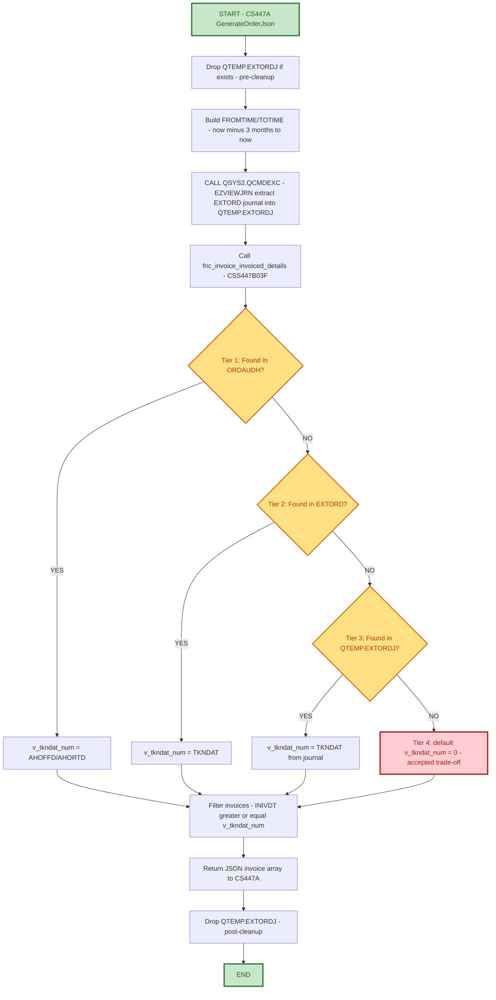

# Support Hand-Off Documentation
## Order Taken Date Resolution for Invoice Filtering (CSS447B03F / CS447A)

---

### Document Control Information

| Field | Details |
|-------|---------|
| **Project Name** | EPIC - Order Invoice Details - Order Taken Date Fallback Resolution (CSS447B03F) |
| **Incident** | EOM429 / OMS2489 - Partial invoice information missing in EPIC |
| **Jira ID** | OMS-2489 (EOM429 - Order Taken Date Resolution for fnc_invoice_invoiced_details) |
| **Revision Level Covered** | PK-F / PK-I (re-instated bounded journal fallback) |
| **Related Programs** | `EOM429\CS447B03F.sql` (`fnc_invoice_invoiced_details`), `EOM429\CS447A.sqlrpgle` (caller / `GenerateOrderJson`) |
| **Developed by** | Sathyaraja |
| **Date Created** | 09/28/2026 |
| **Support Hand-Off Date** | 09/29/2026 |
| **Document Version** | 1.0 |
| **Support Team** | Order Management - Primary Support |
| **Escalation Team** | Order Management Development |

---

## 1. PROJECT SCOPE

### 1.1 Project Overview and Business Objectives

**Program Name:** `fnc_invoice_invoiced_details` (`CSS447B03F`), called from `GenerateOrderJson` in `CS447A` - returns the JSON array of invoices EPIC displays for an order.

**Business Purpose:**
`fnc_invoice_invoiced_details` filters invoices returned to EPIC using:

```sql
where INIVDT >= v_tkndat_num
```

`v_tkndat_num` is the order's "taken date" - the date the order was placed under its **current** warehouse/ship-to combination. It exists to exclude stale invoice history that belongs to a prior warehouse/ship-to, for orders that went through a `WHSESWITCH`/`SHIPSWITCH` event. The taken date was originally resolved from `ORDAUDH` only.

**Incident Trigger:**
The EOM429 incident occurred because `ORDAUDH` does not retain a row for orders that have been fully invoiced and cleared - for those orders the lookup found nothing, and partial invoice information was dropped entirely from the EPIC response.

**Key Business Value:**
- **No More Silent Drops**: Orders whose `ORDAUDH` row has been cleared now fall through to additional lookups instead of returning no invoices at all.
- **Switch-Aware Filtering Preserved**: Where the taken date can be recovered (from `ORDAUDH`, `EXTORD`, or the bounded journal extract), the original stale-invoice guard continues to work correctly across warehouse/ship-to switches.
- **Bounded Cost**: The journal-based recovery tier is bounded to a 3-month `FROMTIME`/`TOTIME` window rather than a full, unbounded journal replay on every call.

### 1.2 Key Enhancement - Revisions PK-D through PK-I (Functional Summary)

**In plain terms:** the function still does the same job it always did - find the order's taken date and use it to filter which invoices EPIC sees. What changed is *how many places it looks* before giving up.

| Tier | Source | When it applies | Outcome |
|:-----|:-------|:-----------------|:--------|
| **1. ORDAUDH** | Existing lookup, current warehouse/ship-to audit history | Always tried first | `v_tkndat_num = AHOFFD`/`AHORTD` |
| **2. EXTORD** | Live order file | `ORDAUDH` row not found - order still open or only cleared from `CODATAN` (partial invoice) | `v_tkndat_num = TKNDAT` |
| **3. QTEMP.EXTORDJ** | Journal-extracted snapshot of `EXTORD`, built via `EZVIEWJRN` (bounded to last 3 months), run by the caller (`CS447A`) before invoking this function | `EXTORD` row also not found - order fully invoiced and cleared from `COMAST`/`CODATAN`/`EXTORD` | `v_tkndat_num = TKNDAT` recovered from journal |
| **4. Default 0** | N/A | Taken date unrecoverable from all three tiers (also predates the 3 month journal window, or `EZVIEWJRN` failed) | `v_tkndat_num = 0` - accepted trade-off, see Section 5 |

**Bottom line for support:**
- The filter logic (`INIVDT >= v_tkndat_num`) is unchanged - only the **source** of `v_tkndat_num` has more fallback tiers now.
- Tiers 1-3 all produce a real, correct taken date; only tier 4 (default 0) is a known trade-off that can surface stale, pre-switch invoices for a narrow class of orders (see Section 5).
- If you're troubleshooting a wrong/extra invoice on a switched order, the question to ask is "did this order's taken date resolve via tier 1/2/3, or did it fall through to the tier-4 default?" - not "is the filter logic broken."

---

## 2. PROGRAM FLOW

### 2.1 Mermaid Flow Diagram



### 2.2 Fallback Chain - Functional Explanation

This is the shared "resolve the taken date" step every call to `fnc_invoice_invoiced_details` passes through before filtering invoices:

1. Look up `ORDAUDH` for the order's current warehouse/ship-to audit row. If found, use `AHOFFD`/`AHORTD`.
2. If not found, look up `EXTORD` for the live `TKNDAT`. If found, use it.
3. If not found, look up `QTEMP.EXTORDJ` (built by `CS447A` via a bounded `EZVIEWJRN` extract of the `EXTORD` journal, last 3 months). If found, use it.
4. If none of the three are found, default `v_tkndat_num` to `0` (see Section 5 for the accepted trade-off this causes).
5. Filter invoices using `INIVDT >= v_tkndat_num` and return the JSON array.

**Why this matters to support:** this fallback chain runs **identically** on every call, regardless of which warehouse/ship-to switch history the order has. So if you're troubleshooting missing or unexpected invoices on an order, the question is "which tier resolved (or failed to resolve) the taken date for this specific order" - not "is the JSON filter itself broken."

---

## 3. DECISION HISTORY: TIER 3 (QTEMP.EXTORDJ / EZVIEWJRN) REMOVED, THEN RE-INSTATED

Tier 3 was implemented (revision `PK-D`/`PK-H`) and then **removed** (revision `PK-E`
in the function, `PK-H` rollback in the caller) for the following reasons:

- **Cost on every call, not just when needed.** `CSS447B03F` is a read-only SQL
  scalar function and cannot itself run `EZVIEWJRN` (a CL command via
  `QSYS2.QCMDEXC`), since SQL functions cannot perform side-effecting calls. The
  extraction had to be moved to the caller, `CS447A.sqlrpgle`, which then ran
  `DROP TABLE QTEMP.EXTORDJ` -> `EZVIEWJRN` -> query -> `DROP TABLE QTEMP.EXTORDJ`
  on **every single API invocation**, regardless of whether any order in that
  request actually needed the tier-3 fallback. This adds journal-extraction
  overhead and two extra SQL/CL round-trips to the critical path of every request.
- **QTEMP is job-scoped, not request-scoped.** If the job hosting `CS447A` is ever
  reused to serve overlapping or concurrent requests (rather than strictly one
  request per job, run to completion), the drop/create/query sequence for one
  request can race against another request's drop/create/query sequence against
  the same `QTEMP.EXTORDJ` file, risking intermittent SQL errors or incorrect
  results for unrelated orders. This could not be verified as safe for the current
  job/execution model.
- **Failure is silent by design.** The `EZVIEWJRN` call was wrapped in
  `monitor`/`on-error` so a failure there (journal not active, receiver issue,
  authority problem) would not fail the API request - but that also means a real
  infrastructure problem would go unnoticed, silently falling through to the same
  default-0 behavior described below.

Given the added latency/operational cost and residual concurrency risk of tier 3,
the decision at that time was to **stop at tier 2 (EXTORD)** and accept the
default-0 fallback documented below for the remaining case, rather than adding a
per-request journal extraction to every call of this API.

### 3.1 Re-Instatement (Revisions PK-F / PK-I)

Re-instatement spans both programs:
- `EOM429\CS447B03F.sql` - revision **PK-F**: restores tier 3 (`QTEMP.EXTORDJ` lookup)
  in `fnc_invoice_invoiced_details` between the `EXTORD` fallback and the default-0
  fallback.
- `EOM429\CS447A.sqlrpgle` - revision **PK-I**: restores the `EZVIEWJRN` extraction in
  `GenerateOrderJson` (pre-cleanup drop of `QTEMP.EXTORDJ`, bounded `FROMTIME`/`TOTIME`
  build, `EZVIEWJRN` call via `QSYS2.QCMDEXC` wrapped in `monitor`/`on-error`, and
  post-use cleanup drop on both the error and success paths), so `QTEMP.EXTORDJ`
  exists for `CS447B03F` to query.

Both open concerns from Section 3 above were resolved before re-instating:

- **Concurrency risk closed.** Confirmed that `CS447A` runs as a genuine
  interactive job - one workstation/device session per job, never reused or
  pooled across overlapping requests. This is the same 1:1 job-to-session model
  IBM i interactive jobs always use, so the `QTEMP.EXTORDJ` drop/create/query
  sequence for one request can never race against another request's sequence.
- **Per-call cost bounded, not eliminated.** `EZVIEWJRN` is still run on every
  call to `GenerateOrderJson` (there was no reliable way to detect in advance,
  without cost, whether the current order set would need tier 3), but the
  extraction is now bounded with `FROMTIME`/`TOTIME` to the last 3 months up to
  the current timestamp, instead of a full/unbounded journal replay. This caps
  the worst-case extraction volume per call to 3 months of `EXTORD` journal
  activity rather than the file's entire journal history.
- Failure of the `EZVIEWJRN` call remains wrapped in `monitor`/`on-error` (see
  Section 3 above) - if it fails, tier 3 simply yields nothing and the chain
  falls through to tier 4 (default 0), same as before re-instatement.

---

## 4. FALLBACK TIER REFERENCE (POST PK-F / PK-I)

| Tier | Source | Trigger | Result |
|:-----|:-------|:--------|:-------|
| 1 | `ORDAUDH` | Always tried first | `v_tkndat_num = AHOFFD`/`AHORTD` |
| 2 | `EXTORD` | Tier 1 not found | `v_tkndat_num = TKNDAT` |
| 3 | `QTEMP.EXTORDJ` | Tier 2 not found | `v_tkndat_num = TKNDAT` (from `EZVIEWJRN` extract, last 3 months, built by `CS447A`) |
| 4 | Default | Tier 3 not found | `v_tkndat_num = 0` - accepted trade-off, see Section 5 |

---

## 5. IMPACT ANALYSIS OF THE DEFAULT-0 FALLBACK

When `ORDAUDH`, `EXTORD`, and `QTEMP.EXTORDJ` all miss - which now only happens for
orders that have been **fully invoiced and cleared** from `COMAST`/`CODATAN`/`EXTORD`
**and** whose taken date also falls outside the 3 month `EZVIEWJRN` extraction window
(or the `EZVIEWJRN` extraction itself failed) - `v_tkndat_num` defaults to `0`.

Because the invoice filter is `INIVDT >= v_tkndat_num`, and `INIVDT` (invoice date)
is always a positive value for any real invoice, a taken date of `0` makes this
condition **true for every invoice ever issued against the order**, with no lower
bound.

**Consequence:** For an order that went through one or more warehouse/ship-to
switches (`WHSESWITCH`/`SHIPSWITCH`) during its life, and whose taken date is now
unrecoverable (fully invoiced/cleared case), invoices issued **before the very
first switch** - i.e. under a prior, now-stale warehouse or ship-to combination -
are **no longer excluded** by the date guard. Those old invoices, which the taken
date filter was originally designed to hide, **may now appear in the EPIC
response** alongside the current, correct invoices for that order.

**Scope of exposure:** This only affects orders where:
- the order has been fully invoiced and cleared (no `ORDAUDH` row, no `EXTORD` row), **and**
- the recoverable taken date also falls outside the 3 month `EZVIEWJRN` window used to
  build `QTEMP.EXTORDJ` (or the `EZVIEWJRN` extraction failed), **and**
- the order underwent at least one warehouse or ship-to switch during its life.

Orders that were never switched are unaffected, since without a switch there is no
"prior, stale" invoice history to leak - all of the order's invoices legitimately
belong to the same warehouse/ship-to.

**Trade-off accepted:** This is a deliberate choice to favor **surfacing
potentially stale invoice history** over **silently dropping partial invoice
information**, which was the original EOM429/OMS2489 symptom. Returning some extra,
old invoice rows for a small subset of switched-and-cleared orders is considered
less harmful than omitting invoice data outright for those same orders.

---

## 6. SUPPORT RESPONSIBILITIES

### 6.1 Primary Support Team: Order Management

**Responsibilities:**
1. ✅ When an EPIC ticket reports missing or unexpected/duplicate invoices for an order, identify whether the order underwent a `WHSESWITCH`/`SHIPSWITCH` (check `ORDAUDH` audit history, `AHTKNBY`/`ADUSRC` tagging).
2. ✅ For a switched order, determine which fallback tier resolved `v_tkndat_num` (see Section 4/7 queries) - `ORDAUDH`, `EXTORD`, `QTEMP.EXTORDJ`, or the tier-4 default.
3. ✅ If tier 4 (default 0) was used and stale/pre-switch invoices are appearing, confirm this matches the accepted trade-off in Section 5 before escalating as a bug.
4. ✅ Confirm whether `EZVIEWJRN` extraction itself failed (journal not active, receiver issue, authority problem) vs. simply finding no matching row - see Section 7 queries.
5. ✅ Escalate genuine `EZVIEWJRN`/journal infrastructure failures to Order Management Development.

**What Support Does NOT Do:**
- ❌ Modify `CS447A`/`CSS447B03F` program logic.
- ❌ Manually alter `ORDAUDH`/`EXTORD` rows to "fix" a taken date without dev sign-off.
- ❌ Widen the `EZVIEWJRN` `FROMTIME` window in production without dev/perf review (see Section 8).

### 6.2 Escalation Team: Order Management Development

**Role:** Resolve cases where `v_tkndat_num` resolution behaves unexpectedly across all four tiers, or where the Section 5 trade-off needs revisiting (e.g. tier-4 exposure becomes frequent enough to require one of the Section 8 mitigations).

**Escalation Required When:**
- `EZVIEWJRN`/`QSYS2.QCMDEXC` consistently fails in `CS447A` (not just "row not found" - an actual command failure).
- The tier-4 default-0 trade-off is producing stale invoices for orders where the switch happened **within** the 3-month window (this would indicate a tier-3 bug, not the accepted/expected trade-off).

---

## 7. SUPPORT PROCEDURES / SQL QUERIES

**Check ORDAUDH (Tier 1) for an order's taken date**
```sql
SELECT AHORNO, AHWHSE, AHCUST, AHSHIP, AHORTD, AHOFFD
  FROM ORDAUDH
 WHERE AHORNO = :order_no AND AHWHSE = :warehouse
   AND AHCUST = :customer_no AND AHSHIP = :shipto
 ORDER BY AHORTD DESC;
```

**Check EXTORD (Tier 2) for an order's taken date**
```sql
SELECT ORDNO, CUSNO, SHIPTO, HOUSE, TKNDAT
  FROM EXTORD
 WHERE ORDNO = :order_no AND CUSNO = :customer_no
   AND SHIPTO = :shipto AND HOUSE = :warehouse;
```

**Check QTEMP.EXTORDJ (Tier 3) after CS447A has run for the session**
```sql
SELECT ORDNO, CUSNO, SHIPTO, HOUSE, TKNDAT
  FROM QTEMP.EXTORDJ
 WHERE ORDNO = :order_no AND CUSNO = :customer_no
   AND SHIPTO = :shipto AND HOUSE = :warehouse;
```
*Note: `QTEMP.EXTORDJ` is job-scoped and only exists transiently during a `CS447A` request in that interactive job's session - it will not be queryable from a separate session.*

**Find invoices actually returned for an order (post-filter)**
```sql
SELECT ININVR, INIVDT, INORNO, INCSNO, INWHSE, SSSPNO
  FROM TSININ
  INNER JOIN TSSSIN ON SSINVR = ININVR
 WHERE INORNO = :order_no AND INCSNO = :customer_no
   AND INRODT = :po_date AND INWHSE = :warehouse AND SSSPNO = :shipto
 ORDER BY INIVDT;
```

---

## 8. FUTURE MITIGATION OPTIONS (NOT IMPLEMENTED)

If the residual stale-invoice exposure described in Section 5 (orders whose taken date falls outside the 3 month `EZVIEWJRN` window) proves unacceptable in practice, options to revisit include:
- Widening the `EZVIEWJRN` `FROMTIME` window beyond 3 months, trading additional per-call extraction cost for a smaller residual exposure window.
- Gating the `EZVIEWJRN` call so it only runs when the current request's order set actually contains at least one order missing from both `ORDAUDH` and `EXTORD` (avoiding the per-call cost for requests that never need tier 3).
- Persisting the order's taken date on a permanent, durable field (e.g. a new column populated at the time of switch, rather than reconstructed after the fact) so it survives full invoicing/clearing without requiring journal recovery at read time.

---

## 9. PROGRAM DEPENDENCIES

**Related/Reference Programs:**
- `CS447A.sqlrpgle` - `GenerateOrderJson`, caller of `fnc_invoice_invoiced_details`; owns `EZVIEWJRN` extraction and `QTEMP.EXTORDJ` lifecycle (revision PK-I).
- `CSS447B03F.sql` - `fnc_invoice_invoiced_details`; owns the 4-tier taken-date fallback and invoice filter (revision PK-F).
- `CS424V2W01` - in-place `UPDATE` style warehouse/ship-to switch writer.
- `CS312A` / `CS269` - cancel-and-recreate style switch writers (new `ORDAUDH` row with shifted date).

**Key Tables:**
- `ORDAUDH` / `ORDAUDD` - Order audit header/detail, records `WHSESWITCH`/`SHIPSWITCH` events.
- `EXTORD` - Live order file; source of `TKNDAT` for open/partially-invoiced orders.
- `QTEMP.EXTORDJ` - Job-scoped, transient journal extract of `EXTORD` (last 3 months), built by `CS447A`.
- `TSININ` / `TSSSIN` - Invoice header/ship-to detail, source of `INIVDT` used in the invoice filter.

---

**Document Created By:** Sathyaraja
**Date:** 09/29/2026

---

**END OF SUPPORT HAND-OFF DOCUMENTATION**
