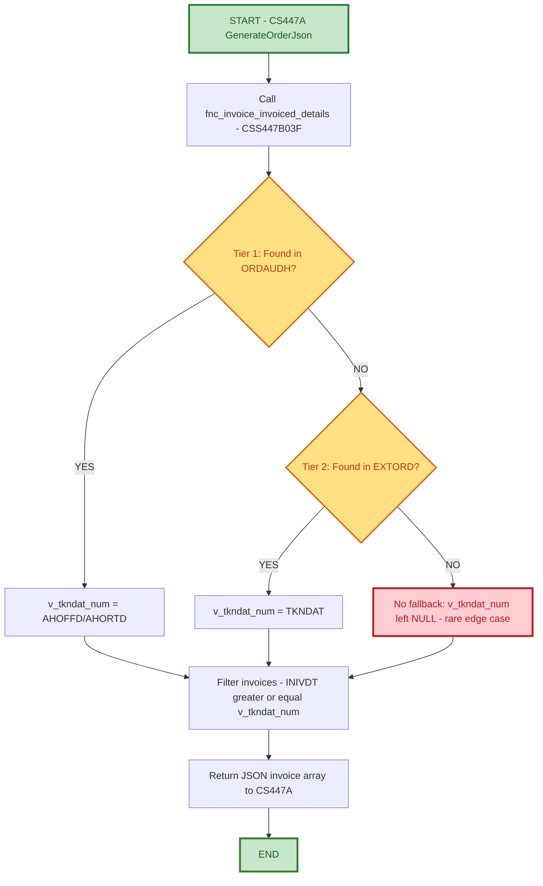

# Support Hand-Off Documentation
## Order Taken Date Resolution for Invoice Filtering (CSS447B03F / CS447A)

---

### Document Control Information

| Field | Details |
|-------|---------|
| **Project Name** | EPIC - Order Invoice Details - Order Taken Date Fallback Resolution (CSS447B03F) |
| **Incident** | EOM429 / OMS2489 - Partial invoice information missing in EPIC |
| **Jira ID** | OMS-2489 (EOM429 - Order Taken Date Resolution for fnc_invoice_invoiced_details) |
| **Revision Level Covered** | PK-G / PK-J (team-confirmed simplification - 2-tier fallback, journal recovery removed) |
| **Related Programs** | `EOM429\CS447B03F.sql` (`fnc_invoice_invoiced_details`), `EOM429\CS447A.sqlrpgle` (caller / `GenerateOrderJson`) |
| **Developed by** | Sathyaraja |
| **Date Created** | 09/28/2026 |
| **Support Hand-Off Date** | 09/29/2026 |
| **Document Version** | 1.0 |
| **Support Team** | Order Management - Primary Support |
| **Escalation Team** | Order Management Development |

---

## 1. PROJECT SCOPE

### 1.1 Project Overview and Business Objectives

**Program Name:** `fnc_invoice_invoiced_details` (`CSS447B03F`), called from `GenerateOrderJson` in `CS447A` - returns the JSON array of invoices EPIC displays for an order.

**Business Purpose:**
`fnc_invoice_invoiced_details` filters invoices returned to EPIC using:

```sql
where INIVDT >= v_tkndat_num
```

`v_tkndat_num` is the order's "taken date" - the date the order was placed under its **current** warehouse/ship-to combination. It exists to exclude stale invoice history that belongs to a prior warehouse/ship-to, for orders that went through a `WHSESWITCH`/`SHIPSWITCH` event. The taken date was originally resolved from `ORDAUDH` only.

**Incident Trigger:**
The EOM429 incident occurred because `ORDAUDH` does not retain a row for orders that have been fully invoiced and cleared - for those orders the lookup found nothing, and partial invoice information was dropped entirely from the EPIC response. A missing `ORDAUDH` row is itself the rare edge case (the vast majority of orders have a matching `ORDAUDH` row); when it does happen, `EXTORD` is checked next.

**Key Business Value:**
- **No More Silent Drops for the Rare Edge Case**: For the rare case where `ORDAUDH` has no row for the order, the function now falls back to `EXTORD` instead of returning no invoices at all. `EXTORD` still carries a live row for orders that are still open or only partially invoiced, so the taken date can be recovered from there.
- **Switch-Aware Filtering Preserved**: Where the taken date can be recovered (from `ORDAUDH` or `EXTORD`), the original stale-invoice guard continues to work correctly across warehouse/ship-to switches.
- **Simple, Low-Cost Chain**: No journal extraction, no per-call `QSYS2.QCMDEXC`/`EZVIEWJRN` overhead, and no job-scoped `QTEMP` file lifecycle to manage. The fallback is two straight-forward table lookups.

### 1.2 Key Enhancement - Revisions PK-D through PK-J (Functional Summary)

**In plain terms:** the function still does the same job it always did - find the order's taken date and use it to filter which invoices EPIC sees. What changed is *how many places it looks* before giving up.

| Tier | Source | When it applies | Outcome |
|:-----|:-------|:-----------------|:--------|
| **1. ORDAUDH** | Existing lookup, current warehouse/ship-to audit history | Always tried first - matches for the vast majority of orders | `v_tkndat_num = AHOFFD`/`AHORTD` |
| **2. EXTORD** | Live order file | `ORDAUDH` row not found - this itself is the rare edge case (order fully invoiced and cleared, order still open/partially invoiced with the audit row never written, or cleared from `CODATAN` only). `EXTORD` still has a live row for open and partially invoiced orders, so it is used to recover the taken date. | `v_tkndat_num = TKNDAT` |
| **(no further fallback)** | N/A | `EXTORD` row also not found - the order is fully invoiced and cleared from `COMAST`/`CODATAN`/`EXTORD` as well | `v_tkndat_num` left unresolved (`NULL`) - no invoices returned for that order, see Section 5 |

**Bottom line for support:**
- The filter logic (`INIVDT >= v_tkndat_num`) is unchanged - only the **source** of `v_tkndat_num` has an extra fallback tier now (`EXTORD`).
- Tier 1 (`ORDAUDH`) resolves the taken date for the vast majority of orders. Reaching tier 2 at all (`ORDAUDH` row not found) is already the rare edge case; both tiers missing is rarer still - see Section 5.
- If you're troubleshooting missing invoices on a fully-invoiced/cleared, switched order, the question to ask is "did this order's taken date resolve via tier 1/2, or did both lookups miss?" - not "is the filter logic broken."

---

## 2. PROGRAM FLOW

### 2.1 Mermaid Flow Diagram



### 2.2 Fallback Chain - Functional Explanation

This is the shared "resolve the taken date" step every call to `fnc_invoice_invoiced_details` passes through before filtering invoices:

1. Look up `ORDAUDH` for the order's current warehouse/ship-to audit row. If found, use `AHOFFD`/`AHORTD`.
2. If not found, look up `EXTORD` for the live `TKNDAT`. `EXTORD` still has a row for orders that are still open or only partially invoiced, so this recovers the taken date for those orders. If found, use it.
3. If neither is found, `v_tkndat_num` is left unresolved (`NULL`) - see Section 5 for the effect this has on the invoice filter.
4. Filter invoices using `INIVDT >= v_tkndat_num` and return the JSON array.

**Why this matters to support:** this fallback chain runs **identically** on every call, regardless of which warehouse/ship-to switch history the order has. So if you're troubleshooting missing or unexpected invoices on an order, the question is "which tier resolved (or failed to resolve) the taken date for this specific order" - not "is the JSON filter itself broken."

---

## 3. DECISION HISTORY: TIER 3 (QTEMP.EXTORDJ / EZVIEWJRN) REMOVED, RE-INSTATED, THEN REMOVED AGAIN

Tier 3 was implemented (revision `PK-D`/`PK-H`) and then **removed** (revision `PK-E`
in the function, `PK-H` rollback in the caller) for the following reasons:

- **Cost on every call, not just when needed.** `CSS447B03F` is a read-only SQL
  scalar function and cannot itself run `EZVIEWJRN` (a CL command via
  `QSYS2.QCMDEXC`), since SQL functions cannot perform side-effecting calls. The
  extraction had to be moved to the caller, `CS447A.sqlrpgle`, which then ran
  `DROP TABLE QTEMP.EXTORDJ` -> `EZVIEWJRN` -> query -> `DROP TABLE QTEMP.EXTORDJ`
  on **every single API invocation**, regardless of whether any order in that
  request actually needed the tier-3 fallback. This adds journal-extraction
  overhead and two extra SQL/CL round-trips to the critical path of every request.
- **QTEMP is job-scoped, not request-scoped.** If the job hosting `CS447A` is ever
  reused to serve overlapping or concurrent requests (rather than strictly one
  request per job, run to completion), the drop/create/query sequence for one
  request can race against another request's drop/create/query sequence against
  the same `QTEMP.EXTORDJ` file, risking intermittent SQL errors or incorrect
  results for unrelated orders. This could not be verified as safe for the current
  job/execution model.
- **Failure is silent by design.** The `EZVIEWJRN` call was wrapped in
  `monitor`/`on-error` so a failure there (journal not active, receiver issue,
  authority problem) would not fail the API request - but that also means a real
  infrastructure problem would go unnoticed, silently falling through to the same
  default-0 behavior described below.

Given the added latency/operational cost and residual concurrency risk of tier 3,
the decision at that time was to **stop at tier 2 (EXTORD)** and accept the
default-0 fallback documented below for the remaining case, rather than adding a
per-request journal extraction to every call of this API.

### 3.1 Re-Instatement (Revisions PK-F / PK-I)

Re-instatement spans both programs:
- `EOM429\CS447B03F.sql` - revision **PK-F**: restores tier 3 (`QTEMP.EXTORDJ` lookup)
  in `fnc_invoice_invoiced_details` between the `EXTORD` fallback and the default-0
  fallback.
- `EOM429\CS447A.sqlrpgle` - revision **PK-I**: restores the `EZVIEWJRN` extraction in
  `GenerateOrderJson` (pre-cleanup drop of `QTEMP.EXTORDJ`, bounded `FROMTIME`/`TOTIME`
  build, `EZVIEWJRN` call via `QSYS2.QCMDEXC` wrapped in `monitor`/`on-error`, and
  post-use cleanup drop on both the error and success paths), so `QTEMP.EXTORDJ`
  exists for `CS447B03F` to query.

Both open concerns from Section 3 above were resolved before re-instating:

- **Concurrency risk closed.** Confirmed that `CS447A` runs as a genuine
  interactive job - one workstation/device session per job, never reused or
  pooled across overlapping requests. This is the same 1:1 job-to-session model
  IBM i interactive jobs always use, so the `QTEMP.EXTORDJ` drop/create/query
  sequence for one request can never race against another request's sequence.
- **Per-call cost bounded, not eliminated.** `EZVIEWJRN` is still run on every
  call to `GenerateOrderJson` (there was no reliable way to detect in advance,
  without cost, whether the current order set would need tier 3), but the
  extraction is now bounded with `FROMTIME`/`TOTIME` to the last 3 months up to
  the current timestamp, instead of a full/unbounded journal replay. This caps
  the worst-case extraction volume per call to 3 months of `EXTORD` journal
  activity rather than the file's entire journal history.
- Failure of the `EZVIEWJRN` call remains wrapped in `monitor`/`on-error` (see
  Section 3 above) - if it fails, tier 3 simply yields nothing and the chain
  falls through to tier 4 (default 0), same as before re-instatement.

### 3.2 Removed Again - Team-Confirmed Simplification (Revisions PK-G / PK-J)

Following further team discussion, the journal-based tier 3 (`QTEMP.EXTORDJ` /
`EZVIEWJRN`) was **removed a second time**, and this time the default-0 fallback
for the remaining miss case was **removed as well**:

- `EOM429\CS447B03F.sql` - revision **PK-G**: removes tier 3 (`QTEMP.EXTORDJ`
  lookup) and the default-0 fallback from `fnc_invoice_invoiced_details`. The
  chain now stops at `EXTORD` (tier 2); if that also misses, `v_tkndat_num` is
  left unresolved (`NULL`).
- `EOM429\CS447A.sqlrpgle` - revision **PK-J**: removes the `EZVIEWJRN`
  extraction and `QTEMP.EXTORDJ` lifecycle management (pre/post cleanup) from
  `GenerateOrderJson`, since `CSS447B03F` no longer queries that table.

**Rationale:** `ORDAUDH` not having a row for the order (which triggers the fallback
to `EXTORD` at all) is itself the rare edge case - the vast majority of orders
resolve at tier 1. The team confirmed that `EXTORD` alone is sufficient fallback
coverage for this rare case, and that the further, rarer sub-case where **both**
`ORDAUDH` and `EXTORD` miss (order fully invoiced and cleared from
`COMAST`/`CODATAN`/`EXTORD`) is not common enough to justify the per-call journal
extraction cost and `QTEMP` lifecycle management that tier 3 required. The
default-0 fallback for that residual miss case is also removed pending further
team discussion - see Section 5 for the current behavior when both lookups miss.

---

## 4. FALLBACK TIER REFERENCE (POST PK-G / PK-J)

| Tier | Source | Trigger | Result |
|:-----|:-------|:--------|:-------|
| 1 | `ORDAUDH` | Always tried first | `v_tkndat_num = AHOFFD`/`AHORTD` |
| 2 | `EXTORD` | Tier 1 not found | `v_tkndat_num = TKNDAT` |
| (none) | N/A | Tier 2 not found | `v_tkndat_num` left `NULL` - see Section 5 |

---

## 5. IMPACT ANALYSIS - ORDAUDH AND EXTORD BOTH MISS

When both `ORDAUDH` and `EXTORD` miss - which happens for orders that have been
**fully invoiced and cleared** from `COMAST`/`CODATAN`/`EXTORD` - `v_tkndat_num`
is left unresolved (`NULL`), since there is no further fallback tier.

Because the invoice filter is `INIVDT >= v_tkndat_num`, and SQL comparisons
against `NULL` evaluate to `UNKNOWN` (never `TRUE`), this condition is **false
for every row**, so **no invoices are returned** for that order.

**Consequence:** This reproduces the original EOM429/OMS2489 symptom (partial
invoice information silently missing from the EPIC response), but now **only**
for the narrower case of orders that have no `ORDAUDH` row **and** no `EXTORD`
row. Note that missing `ORDAUDH` alone is already the rare edge case (see
Section 1.1/1.2); missing both `ORDAUDH` and `EXTORD` is rarer still, since
those orders are fixed by the tier-2 `EXTORD` fallback whenever `EXTORD` still
has a row.

**Scope of exposure:** This only affects orders where:
- the order has been fully invoiced and cleared (no `ORDAUDH` row, no `EXTORD` row).

Whether the order was ever switched (`WHSESWITCH`/`SHIPSWITCH`) is irrelevant to
this residual case - the issue here is a total absence of invoices, not a stale
pre-switch invoice leaking through.

**Trade-off accepted:** The team confirmed this residual case is rare enough to
leave unresolved for now, rather than carrying the per-call journal extraction
cost (tier 3) or reintroducing the default-0 behavior (which favors surfacing
stale invoices over dropping data, but was set aside pending further team
discussion - see Section 8).

---

## 6. SUPPORT RESPONSIBILITIES

### 6.1 Primary Support Team: Order Management

**Responsibilities:**
1. ✅ When an EPIC ticket reports missing invoices for an order, determine which fallback tier resolved `v_tkndat_num` (see Section 4/7 queries) - `ORDAUDH`, `EXTORD`, or neither.
2. ✅ If neither `ORDAUDH` nor `EXTORD` has a row for the order, confirm the order is fully invoiced/cleared and that this matches the accepted, confirmed-rare edge case in Section 5 before escalating as a bug.
3. ✅ If an order that is still open or only partially cleared is missing invoices, escalate immediately - that would indicate a tier-1/tier-2 regression, not the accepted edge case.

**What Support Does NOT Do:**
- ❌ Modify `CS447A`/`CSS447B03F` program logic.
- ❌ Manually alter `ORDAUDH`/`EXTORD` rows to "fix" a taken date without dev sign-off.

### 6.2 Escalation Team: Order Management Development

**Role:** Resolve cases where `v_tkndat_num` resolution behaves unexpectedly across either tier, or where the Section 5 trade-off needs revisiting (e.g. the residual edge case becomes frequent enough to require one of the Section 8 mitigations).

**Escalation Required When:**
- Invoices are missing for an order that still has an `ORDAUDH` or `EXTORD` row (this would indicate a tier-1/tier-2 bug, not the accepted/expected residual case).
- The residual "both miss" case (Section 5) is occurring frequently enough that the team should revisit reinstating a further fallback (journal-based or default-0).

---

## 7. SUPPORT PROCEDURES / SQL QUERIES

**Check ORDAUDH (Tier 1) for an order's taken date**
```sql
SELECT AHORNO, AHWHSE, AHCUST, AHSHIP, AHORTD, AHOFFD
  FROM ORDAUDH
 WHERE AHORNO = :order_no AND AHWHSE = :warehouse
   AND AHCUST = :customer_no AND AHSHIP = :shipto
 ORDER BY AHORTD DESC;
```

**Check EXTORD (Tier 2) for an order's taken date**
```sql
SELECT ORDNO, CUSNO, SHIPTO, HOUSE, TKNDAT
  FROM EXTORD
 WHERE ORDNO = :order_no AND CUSNO = :customer_no
   AND SHIPTO = :shipto AND HOUSE = :warehouse;
```

**Find invoices actually returned for an order (post-filter)**
```sql
SELECT ININVR, INIVDT, INORNO, INCSNO, INWHSE, SSSPNO
  FROM TSININ
  INNER JOIN TSSSIN ON SSINVR = ININVR
 WHERE INORNO = :order_no AND INCSNO = :customer_no
   AND INRODT = :po_date AND INWHSE = :warehouse AND SSSPNO = :shipto
 ORDER BY INIVDT;
```

---

## 8. FUTURE MITIGATION OPTIONS (NOT IMPLEMENTED)

If the residual missing-invoice exposure described in Section 5 (orders fully invoiced/cleared with no `ORDAUDH` or `EXTORD` row) proves unacceptable in practice, options to revisit include:
- Reinstating the bounded journal-based tier 3 (`QTEMP.EXTORDJ` / `EZVIEWJRN`, as implemented under revisions PK-F/PK-I) to recover the taken date from journal history.
- Reinstating a default-0 fallback for the residual miss case (accepting the trade-off of surfacing stale, pre-switch invoices in order to avoid dropping invoice data outright) - pending the team's further discussion on this trade-off.
- Persisting the order's taken date on a permanent, durable field (e.g. a new column populated at the time of switch, rather than reconstructed after the fact) so it survives full invoicing/clearing without requiring journal recovery at read time.

---

## 9. PROGRAM DEPENDENCIES

**Related/Reference Programs:**
- `CS447A.sqlrpgle` - `GenerateOrderJson`, caller of `fnc_invoice_invoiced_details` (revision PK-J).
- `CSS447B03F.sql` - `fnc_invoice_invoiced_details`; owns the 2-tier taken-date fallback and invoice filter (revision PK-G).
- `CS424V2W01` - in-place `UPDATE` style warehouse/ship-to switch writer.
- `CS312A` / `CS269` - cancel-and-recreate style switch writers (new `ORDAUDH` row with shifted date).

**Key Tables:**
- `ORDAUDH` / `ORDAUDD` - Order audit header/detail, records `WHSESWITCH`/`SHIPSWITCH` events.
- `EXTORD` - Live order file; source of `TKNDAT` for open/partially-invoiced orders.
- `TSININ` / `TSSSIN` - Invoice header/ship-to detail, source of `INIVDT` used in the invoice filter.

---

**Document Created By:** Sathyaraja
**Date:** 09/29/2026

---

**END OF SUPPORT HAND-OFF DOCUMENTATION**
